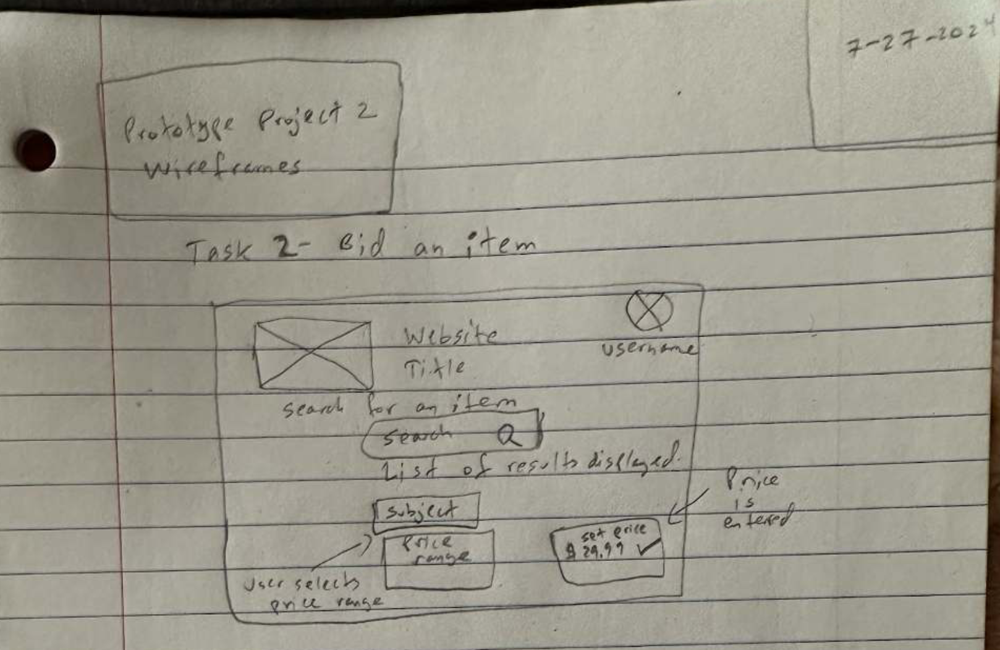
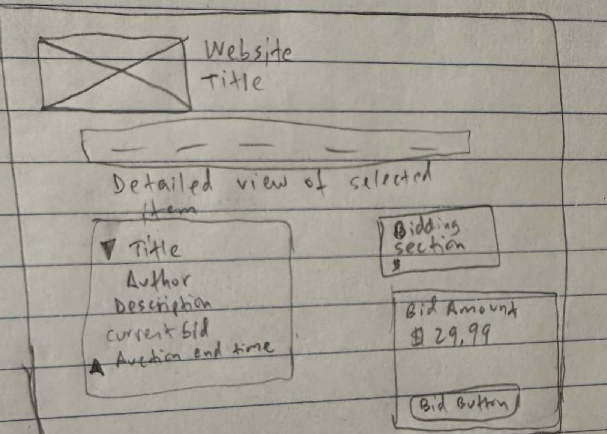
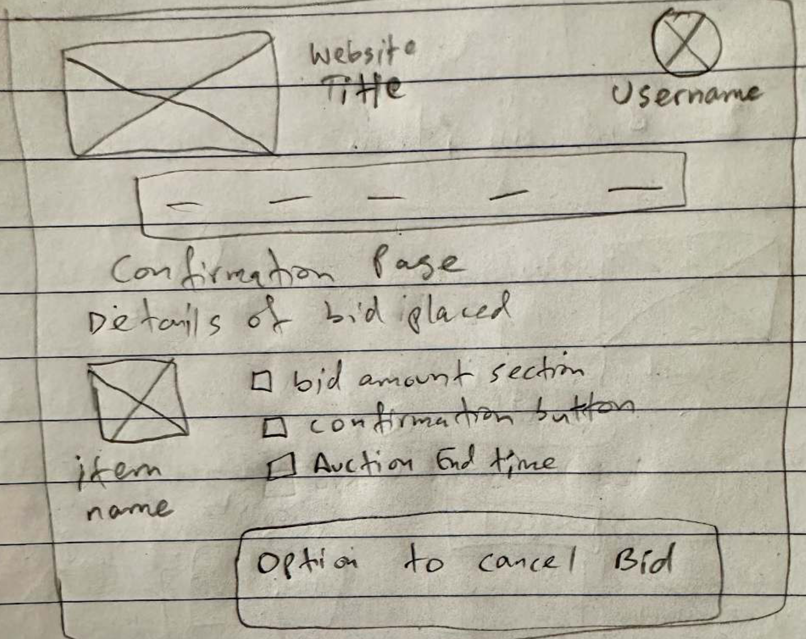
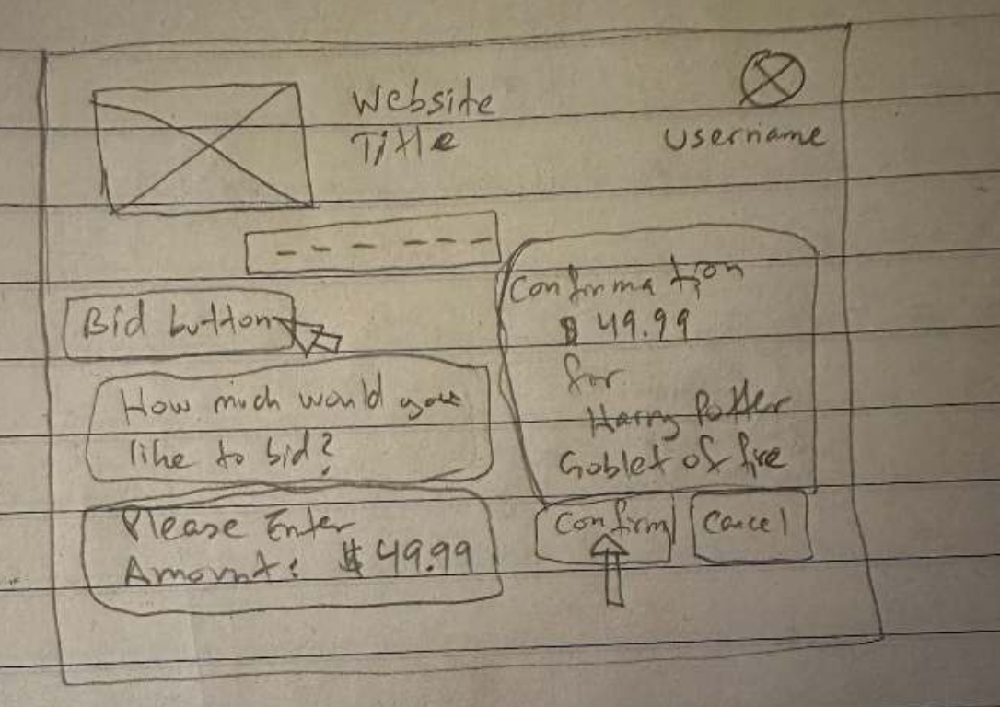

# College Textbook Auction - Paper Prototype UX Case Study

A Human-Computer Interaction project exploring a low-fidelity **college textbook auction and bidding platform** through paper prototyping, sequential storyboards, interaction design, and UX critique.

> **Course:** ITIS 4350 - Rapid Prototyping  
> **Project:** Prototype Project 2 - Paper Prototype  
> **Project type:** Team UX/HCI prototyping project  
> **Methods:** Paper prototyping, wireframing, sequential storyboarding, interaction design, design critique  
> **My documented focus:** Task 2 - Bid on an Item

## Overview

The team designed an online auction experience for college textbooks around four user workflows:

1. **Create an Auction** - review current/past auctions and create a new textbook listing.
2. **Bid on an Item** - search for a book, review the listing, enter a bid, and confirm it.
3. **Review a Seller** - review a past purchase and rate the seller.
4. **Compare Offers** - compare textbook offers using factors such as price, condition, seller history, and ratings.

The paper-prototype stage focused on making the interaction sequence visible before moving to a more polished digital prototype.

## My Contribution - Bid on an Item

My primary responsibility was **Task 2: Bid on an Item**. I designed the flow that takes a user from textbook search through bid confirmation.

Key parts of my work included:

- Searching for textbooks with keywords
- Narrowing results with filters
- Displaying matching books
- Opening a detailed view of a selected listing
- Showing title, author, description, current bid, and auction end time
- Entering a bid amount
- Placing a bid through a clear action button
- Confirming or canceling the bid in a confirmation step

## Paper Prototype Gallery

The selected screens below document the complete bidding journey: **search → inspect → bid → confirm**.

### 1. Search & Results



This opening screen establishes the search-first workflow. A user searches for a textbook, reviews matching results, and uses pricing or filtering cues to decide which listing to inspect.

### 2. Detailed Listing & Bid Entry



The detailed listing presents the information needed before bidding, including the textbook title, author, description, current bid, auction end time, and a field for entering a bid amount.

### 3. Bid Confirmation



The confirmation state gives the user a final review point before committing the bid. This helps prevent accidental submissions and provides a clear confirm-or-cancel decision.

### 4. Sequential Bid Flow



This sequential view demonstrates how the prototype changes after the user enters a bid and proceeds to confirmation, making the interaction logic visible even in a low-fidelity paper prototype.

## Interaction & UX Concepts

The bidding flow explores several interaction-design concepts:

- Search and filtering patterns
- Text input
- Drop-down controls
- Item-detail hierarchy
- Bid amount input
- Primary action buttons
- Confirmation dialogs
- Clear visual hierarchy
- Consistent header/profile placement
- Progressive task flow

## Design Process

1. **Define the task** - identify the steps required to search for and bid on a college textbook.
2. **Sketch the interface** - create paper wireframes for search, listing details, bidding, and confirmation.
3. **Sequence the interaction** - show how user actions move the interface from one state to the next.
4. **Demonstrate the prototype** - use the paper screens as an interactive walkthrough.
5. **Critique and iterate** - identify strengths and areas that should be clarified in future versions.

## Reflection & Opportunities for Improvement

The bidding flow successfully communicates the major steps, especially the search-to-detail-to-confirmation progression. The project critique also identified useful improvements for a future iteration:

- Explain bid increments more clearly so users know how much to increase their bid.
- Provide clearer information about what happens after a bid is confirmed.
- Continue strengthening visual consistency and branding as the prototype moves beyond paper fidelity.

These are useful examples of why rapid prototyping is valuable: questions about confidence, feedback, and action clarity can be discovered before investing in a high-fidelity implementation.

## Team & Attribution

This was a collaborative team project completed by:

| Team member | Documented contribution in the report |
| --- | --- |
| **Qudrat Siyal** | **Task 2 - Bid on an Item** |
| Ayisha Riaz | Task 3 - Review a Seller |
| Chris Parker | Task 4 - Comparing Offers |
| Aaron Rovnak | Team member; Task 1 ownership is not explicitly labeled in the report text |

This repository presents the complete project context while clearly identifying **Task 2 and the bidding flow as my documented individual work**.

## Skills Demonstrated

- Human-Computer Interaction (HCI)
- UX design
- Rapid prototyping
- Paper prototyping
- Wireframing
- Sequential storyboarding
- Interaction design
- Search and filtering design
- Confirmation and feedback design
- Design critique and iteration
- Collaborative product design

## Full Project Report

The complete course report includes the full team prototype, sequential storyboards, design-pattern discussion, fidelity analysis, inspirations, and team critique.

[**View the full Project 2 report (PDF)**](reports/prototype-project-2-paper-prototype.pdf)

## Repository Structure

```text
college-textbook-auction-paper-prototype/
├── README.md
├── PROJECT_INFO.md
├── assets/
│   ├── bid-search-wireframe.jpg
│   ├── bid-detail-wireframe.jpg
│   ├── bid-confirmation-wireframe.jpg
│   ├── bid-flow-confirmation.jpg
│   └── project-2/
│       └── README.md
└── reports/
    ├── README.md
    └── prototype-project-2-paper-prototype.pdf
```

## Academic Context

Created for **ITIS 4350 - Rapid Prototyping** at the University of North Carolina at Charlotte during Summer 2024.

---

This repository is presented as an academic UX/HCI portfolio case study. Team work is attributed according to the project report, and my individual contribution is identified explicitly.
